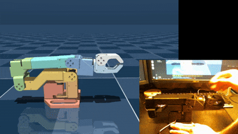

# okay_robot

    **<em>still a work in progress</em>**  
    

### what?
this is a simple 6DOF desktop robot arm inspired by the lerobot arm.

### why?
firstly, so that I can exercise and expand my C++ and robotics knowledge and skills. secondarily,
maybe someone else will find this project helpful to learn and build upon for their own learning.
this project was not started with any feature goals beyond _control robot with computer_.

### how?
free and open source tools and resources on the software side. 3D printing, a handful of STS3215
servos, and a few other odds and ends on the hardware side. the budget goal has and always will be
cheap yet functional.

### who?
me